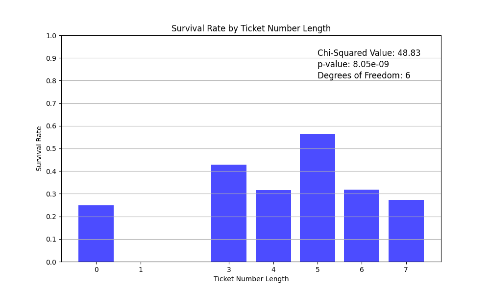

# Model 1.1

A simple logistic regression.

## What's new
- Include Cabin, replacing NaN by 'Missing' str
- Include Ticket as is
- Accuracy threshold stick to 0.5; since for that problem we don't need to penalize 0 or 1.

## Data preprocessing
(preprocessing module)
Since we are with a small CSV dataset, data is loaded in memory as a pandas Dataframe then passed to a Tensorflow model (preprocessing_pipeline)
Missing value handling and feature exclusion are done with pandas before passing data to tensorflow.

**Steps with pandas**
- Load data
- Exclude features
    - Name: try it later
    - Ticket: has 681 unique values on 891 entry, I am not sure
    - PassengerId: useless
- Handling missing value for Embarked feature
    - "Missing" value created
- Send data to Tensorflow

**Preprocess pipeline with Tensorflow**

- Missing value for numeric data are replaced by mean
- Numeric data are normalized by mean and standard deviation
- Categorical data are one-hot encoded

**Notes on EDA**

## Model

Simple logistic regression

**Parameters**
- Total params: 26 (108.00 Byte)

- Trainable params: 17 (68.00 Byte)

- Non-trainable params: 9 (40.00 Byte)

**Hyperparameters**
- learning_rate: 0.01
- epoch: 50

**Results**

|          | Train  | Dev    | Test   |
|----------|--------|--------|--------|
| Loss     | 0.4676 | 0.4277 | 0.4676 |
| Accuracy | 0.7921 | 0.8202 | 0.7765 |

<table>
  <tr>
    <td>  </td>
    <td>  </td>
  </tr>
</table>

File: doc/model_1.0/model_1.0.tf

Submission 2023-27-08: 0.75837 rank 11624