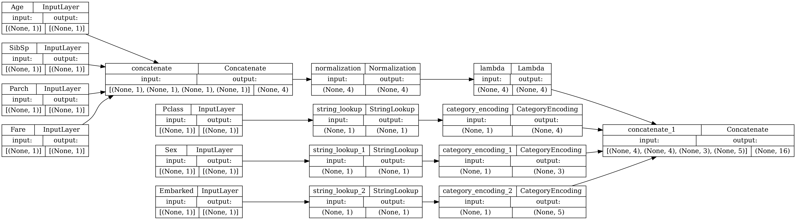
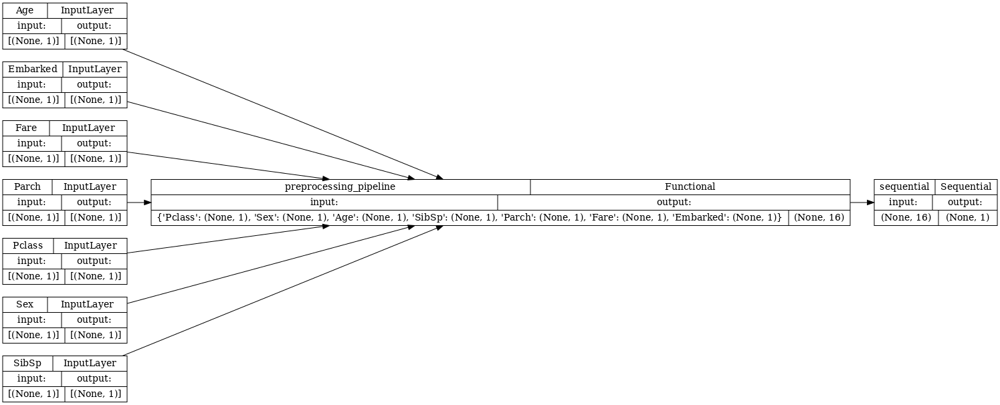

# Model 1.0

A simple logistic regression to use as baseline model.

## Data preprocessing
(preprocessing module)
Since we are with a small CSV dataset, data is loaded in memory as a pandas Dataframe then passed to a Tensorflow model (preprocessing_pipeline)
Missing value handling and feature exclusion are done with pandas before passing data to tensorflow.

**Steps with pandas**
- Load data
- Exclude features
    - Name: try it later
    - Ticket: explore later
    - Cabin: explore later
    - PassengerId: useless
- Handling missing value for Embarked feature
    - "Missing" value created
- Send data to Tensorflow

**Preprocess pipeline with Tensorflow**

- Missing value for numeric data are replaced by mean
- Numeric data are normalized by mean and standard deviation
- Categorical data are one-hot encoded

## Model

Simple logistic regression

Hyperparameters:
- learning_rate: 0.01
- epoch: 50

**Results**

|          | Train  | Dev    | Test   |
|----------|--------|--------|--------|
| Loss     | 0.4676 | 0.4277 | 0.4676 |
| Accuracy | 0.7921 | 0.8202 | 0.7765 |
