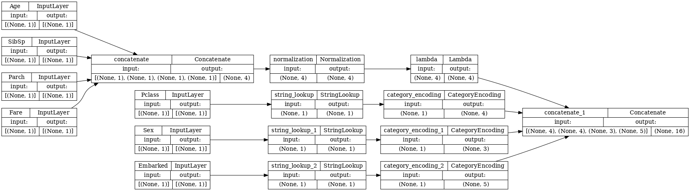

## Data preprocessing
(preprocessing module)
Since we are with a small CSV dataset, data is loaded in memory as a pandas Dataframe then passed to a Tensorflow model (preprocessing_pipeline)
Missing value handling and feature exclusion are done with pandas before passing data to tensorflow.

**Steps with pandas**
- Load data
- Exclude features
- Handling missing value
    - For numerical features: replaced by mean
    - For categorical features: "Missing" value created
- Send data to Tensorflow

**Preprocess pipeline with Tensorflow**

- Numeric data are normalized by mean and standard deviation
- Categorical data are one-hot encoded